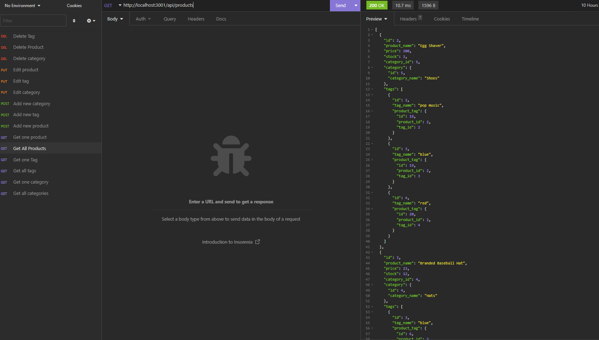

#  Module 13 : E-commerce backend

## Overview

I have amended te backend of an ecommerce site to have working routes for different functionality in regards to the databse and the products, tags, and categories of products.

## Installation

It requires SWL, Node, and a CLI to work. Insomnia ot a similar app will be needed to test it.

## Usage

The application has a database, modeled tables, and seed data to test the funcitonality and realationships between tables. Routes are available to add, edit, and delete individual and batch categories, products, and tags.

### Links

 [Github Repo](https://github.com/sashdc/e-commerce)
 
 [Walkthrough Video](https://drive.google.com/file/d/1T-cn4Y_kMd1bctRrU4GUmKmK2X0fuL5M/view)

 ## Credits

Cherian, Saharsh

[Creator Github](https://github.com/sashdc)

## License

N/A